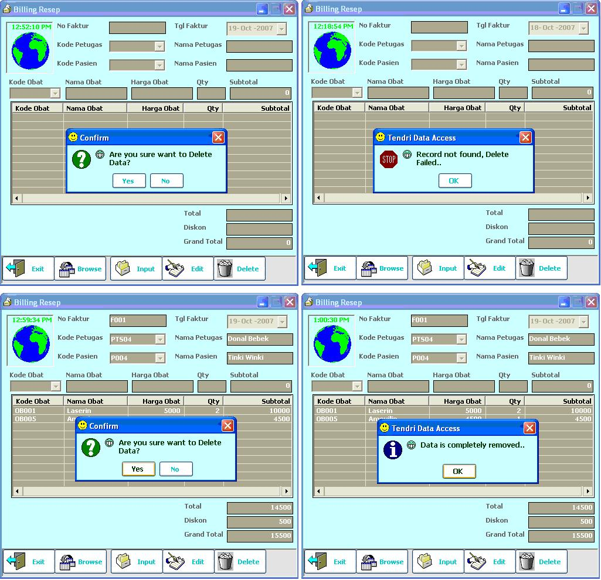



## My DLL\(update\)\+Create your own style MsgBox

### Description

My DLL (EazyDtAcc) has been updated, there are some new methods, you can read on Purpose.txt.

It's essential to do any database access because it simplifies loading and accessing DB using ADODB.

My DLL Application is also equipped with a New Msgbox, replaces vb's standard MsgBox.

With this, you can create your own messagebox, it allows you to set your own font, size, colour, button, skin, etc

so that the messagebox's style is stay same with your application's style. So, have your own style msgbox!

My code is totally free to you to distribute it, use at your own. I just demand you to include my name in a thanks list. Hope this useful for you.. i luv to share ^_~ Any comments and votes would be nice, Thank's.

Enjoy your programming.. ^!^(sorry for my english)
 
### More Info
 

             |
---                |---
**Submitted On**   |2007-10-27 06:05:22
**By**             |[Tendri Salamah](https://github.com/Planet-Source-Code/PSCIndex/blob/master/ByAuthor/tendri-salamah.md)
**Level**          |Beginner
**User Rating**    |5.0 (15 globes from 3 users)
**Compatibility**  |VB 6\.0
**Category**       |[OLE/ COM/ DCOM/ Active\-X](https://github.com/Planet-Source-Code/PSCIndex/blob/master/ByCategory/ole-com-dcom-active-x__1-29.md)
**World**          |[Visual Basic](https://github.com/Planet-Source-Code/PSCIndex/blob/master/ByWorld/visual-basic.md)
**Archive File**   |[My\_DLL\(upd20886610272007\.zip](https://github.com/Planet-Source-Code/tendri-salamah-my-dll-update-create-your-own-style-msgbox__1-69531/archive/master.zip)

